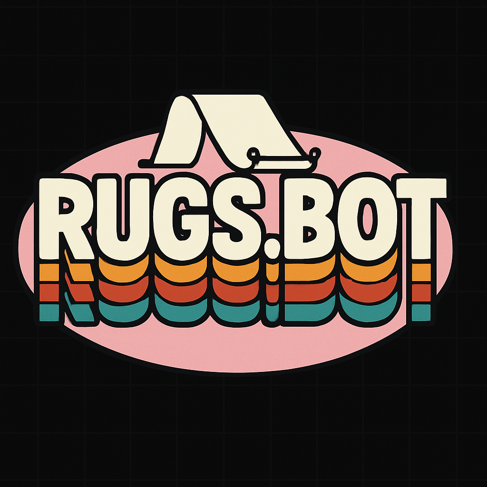

# Majick Karpet - Rugs.fun Game Analytics Bot



# Majick Karpet - Rugs.fun Game Analytics Bot


## Description

Majick Karpet is a Node.js application designed to connect to the `rugs.fun` game, monitor its WebSocket communications, parse game events, track player state, manage risk, simulate trading strategies, and provide analytics on game dynamics. The ultimate goal is to understand game mechanics, player behavior, and develop automated trading strategies.

## Current Status

**Phase 3 Complete: Robust Risk Management, Strategy Simulation, and Core Enhancements**

Building on previous phases, Phase 3 has delivered a sophisticated platform for game analysis and strategy simulation:

*   **Comprehensive Risk Management:** A dedicated `RiskManagerService` performs detailed pre-trade checks against strategy-specific and global limits (e.g., max buy amount, max open trades per strategy, max strategy exposure, global exposure). It accurately tracks capital at risk using cost-basis accounting (FIFO via `PlayerStateService`) and correctly manages open trade counts for simulated trades. Risk state is persisted across sessions.
*   **Strategy Execution & Simulation:** The `StrategyManager` and `StrategyBase` fully support loading, validating configurations of, and running multiple trading strategies. Strategies simulate buy/sell orders via the `TradeExecutionService`, with outcomes tracked by `PlayerStateService` and risk managed by `RiskManagerService`.
*   **Configuration Validation:** The system utilizes Joi for robust schema validation of `config/default.json` at startup, ensuring all critical configurations (including risk parameters) are correct and preventing the bot from starting with invalid settings. Application halts on critical validation errors.
*   **Event-Driven Architecture:** A refined `EventBus` with structured payloads and filtering capabilities ensures decoupled communication between modular services.
*   **Data Integrity:** Implemented a trade event buffer queue in `RugsProtocolAdapter` to prevent loss of trade data if events arrive before game context is established.
*   **Core Data Services:** Robust services for browser integration, WebSocket interception, protocol parsing, raw data logging, real-time game state tracking, detailed player state tracking (including simulated P&L using cost-basis), and end-of-game analytics summaries.

## Core Technologies & Libraries

*   **Node.js:** Runtime environment.
*   **Puppeteer-Core:** To connect to and control the Chrome browser via CDP.
*   **Winston:** For flexible and configurable logging.
*   **Joi:** For configuration validation.
*   **Event Emitter:** Node.js built-in `events` module for decoupled inter-service communication.

## Project Structure

```
MajickKarpet/
├── config/                 # Configuration files (default.json, config-service.js)
├── core/
│   ├── browser/            # Browser management (browser.js)
│   ├── communication/      # WebSocket client and protocol parsing (websocket.js, protocol.js)
│   ├── engine.js           # Main bot orchestrator
│   ├── events/             # Event bus (event-bus.js)
│   ├── services/           # Core services (data-collection, game-state, player-state, game-analytics, risk-manager, trade-execution)
│   └── strategies/         # Trading strategies (strategy-base.js, specific strategy implementations)
│   └── strategy-manager.js # Manages strategy lifecycle
├── data/                   # Persistent data (e.g., risk_manager_state.json)
├── logs/                   # Log files (app.log, raw_websocket_data.jsonl)
├── node_modules/           # NPM dependencies
├── utils/                  # Utility modules (logger.js)
├── .gitignore
├── package.json
├── package-lock.json
├── PROJECT_MEMORY.md       # Concise summary for collaborators
├── README.md               # This file
└── test-phase1.js          # Test script to run the bot and observe functionalities
```

## Setup and Running Instructions

### 1. Prerequisites

*   **Node.js:** Ensure you have Node.js installed (v16.x or later recommended).
*   **Google Chrome:** The bot connects to an existing Chrome instance. You need to launch Chrome manually with remote debugging enabled.
    *   Close ALL existing Chrome instances (check Task Manager/Activity Monitor).
    *   Launch Chrome from your terminal. Example for PowerShell (Windows):
        ```powershell
        Start-Process "C:\Program Files\Google\Chrome\Application\chrome.exe" -ArgumentList @("--remote-debugging-port=9222", "--user-data-dir=$env:USERPROFILE\AppData\Local\Google\Chrome\User Data\TempProfileForBot", "--profile-directory=Default", "https://rugs.fun")
        ```
        *   **Note:** Adjust the path to `chrome.exe` if necessary.
        *   Using a temporary or separate `user-data-dir` like `TempProfileForBot` is recommended to avoid conflicts with your main Chrome profile and to ensure a clean session.
        *   Navigate to `rugs.fun` in this specific Chrome instance.

### 2. Installation

Clone the repository and install dependencies:

```bash
npm install
```

### 3. Configuration

Key configuration options are in `config/default.json`:

*   **`logging`**: Adjust log level, file logging options.
*   **`browser.remoteDebuggingUrl`**: Should match the port used when launching Chrome (default `http://127.0.0.1:9222`).
*   **`webSocketClient.targetUrlPattern`**: Used to identify the correct browser page/tab for WebSocket interception (default `rugs.fun`).
*   **`riskManagement.globalLimits`**:
    *   `maxTotalExposureSOL`: Maximum total SOL the bot is allowed to have at risk across all strategies combined.
    *   `maxConcurrentTradesGlobal`: Maximum number of open trades allowed globally across all strategies. **Note:** While the logic for this check is implemented, it will be more rigorously tested in Phase 4 with multiple active strategies. Carefully set this based on your total capital and risk tolerance for live usage.
    *   `globalMaxBuyAmountSOL`: The largest single buy order (in SOL) the bot can place globally.
*   **`strategies[].config.riskConfig`**: Each strategy has its own `riskConfig` section.
    *   `maxBuyAmountSOL`: Max SOL for a single buy by this strategy.
    *   `maxOpenTradesPerGame`: Max concurrent open trades for this strategy in a single game.
    *   `maxStrategyExposureSOL`: Max total SOL this strategy can have at risk in a game.
    *   `minRequiredSafeTickCount`: Minimum game tick before this strategy can make its first buy.

No API keys are currently required.

### 4. Running the Bot

Once Chrome is running with remote debugging and you are on the `rugs.fun` site, run the test script:

```bash
node test-phase1.js
```

This script initializes all core services and any enabled strategies. Monitor console logs and `logs/` directory.

## Key Services & Modules

*   **`BotEngine` (`core/engine.js`):** Orchestrates the startup, running, and shutdown of all other modules and services.
*   **`BrowserManager` (`core/browser/browser.js`):** Manages the connection to the Chrome instance.
*   **`WebSocketClient` (`core/communication/websocket.js`):** Establishes a CDP session with the target page and forwards WebSocket frames to the event bus.
*   **`RugsProtocolAdapter` (`core/communication/protocol.js`):** Parses raw WebSocket frames, decodes game-specific messages, and emits structured protocol events (e.g., `protocol:gameStateUpdate`, `protocol:tradeEvent`).
*   **`DataCollectionService` (`core/services/data-collection-service.js`):** Logs all raw WebSocket frames to `logs/raw_websocket_data.jsonl` for debugging and potential replay.
*   **`GameStateService` (`core/services/game-state-service.js`):** Consumes `protocol:gameStateUpdate` events, tracks the overall game state (phase, price, active status, new games), and emits higher-level game events (e.g., `game:newGame`, `game:phaseChange`, `game:rugged`).
*   **`PlayerStateService` (`core/services/player-state-service.js`):** Consumes `protocol:tradeEvent` and game events to track individual player balances, investments, and P/L for both SOL and FREE currencies within each game.
*   **`GameAnalyticsService` (`core/services/game-analytics-service.js`):** Listens for `game:rugged` events and calculates/logs summary statistics for the completed game (e.g., house take, total players, total trades).
    *   **Note on FREE Tokens:** While the `PlayerStateService` tracks FREE token balances for individual players, the `GameAnalyticsService` primarily focuses on SOL-based financial metrics for the game summary. FREE token transactions are intentionally separated and do not impact the calculation of "Total SOL Invested," "Total SOL Returned," or "House Take (SOL)." The "0 FREE Tokens Invested/Sold" in the summary is an expected outcome, reflecting that their quantitative flow is not the current focus of the aggregate game analytics.
*   **`EventBus` (`core/events/event-bus.js`):** A singleton event emitter used for decoupled communication between different modules.
*   **`Logger` (`utils/logger.js`):** Configures and provides the Winston logger instance used throughout the application.
*   **`TradeExecutionService`**: Simulates buy/sell orders and emits `trade:simulatedBuy`/`Sell` events.
*   **`RiskManagerService`**: Centralized risk control. Performs pre-trade checks against configured global and strategy-specific limits. Updates exposure based on simulated trades using cost-basis. Persists its exposure state.
*   **`StrategyManager`**: Manages the lifecycle (load, init, start, stop, shutdown) of all trading strategies.
*   **`StrategyBase` & Strategy Implementations**: Define trading logic, call `executeBuy`/`executeSell` (which trigger risk checks), and react to game events.

## Logging

*   Console logs provide real-time operational status and event information.
*   Detailed logs are written to `logs/app.log` (configurable in `config/default.json`).
*   Raw WebSocket data is logged to `logs/raw_websocket_data.jsonl`.

## Future Goals (Phase 4 and Beyond)

*   **Backtesting Engine Development:**
    *   **Data Storage Architecture:** Design and implement a persistent storage solution (e.g., SQLite, then potentially InfluxDB/PostgreSQL) for historical game data, trades, and strategy performance.
    *   **Replay System:** Develop a module to replay historical data, allowing strategies to be tested as if live.
    *   **Performance Analytics:** Create tools for detailed backtesting analysis (P&L, Sharpe/Sortino, drawdown, win rates, etc.).
*   **Advanced Strategy Development:**
    *   Implement more sophisticated strategies utilizing indicators, market conditions, and learned patterns.
    *   Explore human-to-algorithmic translation of successful player behaviors.
*   **Enhanced Telemetry & Diagnostics:**
    *   Develop a system for monitoring bot health and performance in real-time.
    *   Aggregate and categorize errors and config validation failures.
*   **Rigorous Multi-Strategy Testing:**
    *   Thoroughly test `globalMaxConcurrentTradesGlobal` and inter-strategy risk dynamics.
*   **(Future) Advanced UI/Dashboard:** A user interface for live monitoring, historical analysis, and potentially manual interaction.

## Final Architecture Plan & Roadmap (Post Phase 3)

_This section outlines the ongoing vision. For a concise operational summary of the current (End of Phase 3) state, please refer to `PROJECT_MEMORY.md`._

## Core Architecture Enhancements (Phase 3 Completion)

### 1. Event Bus Optimization
- **Event Filtering:** Add category and priority fields to all events.
- **Targeted Subscriptions:** Replace broadcast model with selective receivers.
- **Metrics Collection:** Track event processing times and queue lengths.
- **Implementation:** Extend EventBus with middleware pattern for event enrichment and filtering.

### 2. State Management Enhancements
- **Strategy State Isolation:** Each strategy maintains encapsulated, game-scoped state.
- **Service State Persistence:** Core services persist state to disk periodically.
- **State Snapshots:** Implement state serialization for critical services.
- **State Recovery:** Add initialization from saved state during startup.

### 3. Risk Management Foundation
- **RiskManagerService:** Central service for position sizing and risk control.
- **Strategy Risk Parameters:** Each strategy declares risk parameters in config.
- **Global Risk Limits:** Engine-level position and exposure limits.
- **Risk Events:** New event types (risk:limitReached, risk:warningLevel).

### 4. Configuration System Upgrade
- **Hierarchical Config:** Environment → Global → Strategy-specific.
- **Validation Schema:** Type checking and validation for all config parameters.
- **Config Reloading:** Support for partial config updates without full restart.
- **Separation of Concerns:** Split into system config and strategy config files.

## Technical Implementation Priorities

### 1. Simulated Trade Handling
- **Dedicated Event Type:** Create simulation:tradeExecuted separate from protocol events.
- **Simulation Flag:** Add isSimulated field to all trades.
- **Parallel Accounting:** Track simulated P&L separately from observed game state.
- **Simulation Service:** Create dedicated service for managing simulated trades.

### 2. Strategy Management
- **Enhanced StrategyManager:**
  - Add conflict detection between competing strategies.
  - Implement priority levels for strategy execution.
  - Support strategy pausing/resuming based on conditions.
- **Strategy Lifecycle Extensions:**
  - Add validateConfiguration() hook for safer startup.
  - Create analyzePerformance() hook for end-of-game review.
  - Implement adjustParameters() for adaptive strategies.

### 3. Telemetry & Diagnostics
- **Health Monitoring:**
  - Periodic status checks for all services.
  - Memory and CPU usage tracking.
  - Event processing latency monitoring.
- **Diagnostic Logging:**
  - Structured logging with correlation IDs.
  - Log rotation and compression.
  - Error aggregation and categorization.
- **Minimal Dashboard:**
  - Simple HTTP server exposing key metrics.

## Phase 4 Foundation Work

### 1. Data Storage Architecture
- **Schema Design:** Game events, trade events, strategy performance, and system telemetry schemas.
- **Storage Options:**
  - Short-term: Enhanced JSON log files with indexing.
  - Mid-term: SQLite for structured data.
  - Long-term: InfluxDB for time-series metrics + PostgreSQL for relational data.
- **Data Pipeline:** Collection → Validation → Processing → Storage → Analysis.

### 2. Backtesting Framework Architecture
- **Data Replay System:** Event reconstruction from logs, deterministic replay, time compression.
- **Simulation Environment:** Isolated strategy execution, mock services, realistic fee and latency simulation.
- **Analysis Components:** Performance metrics, strategy comparison, heat maps, and visualization.

### 3. Advanced Analytics Foundation
- **Strategy Metrics:** Sharpe/Sortino ratio, drawdown analyzer, win-rate, profit factor.
- **Game Pattern Analysis:** Rug probability estimator, god candle frequency, liquidity flow tracker.
- **Correlation Framework:** Multi-game pattern detection, strategy correlation matrix, player behavior clustering.

## Implementation Sequence & Milestones

### Immediate (Phase 3 Completion)
- **Week 1: Core Enhancements**
  - Complete Strategy Base Class extensions
  - Implement Enhanced EventBus with filtering
  - Create RiskManager Service skeleton
- **Week 2: State & Configuration**
  - Update Configuration System
  - Implement State Persistence
  - Separate Simulated/Real trade handling
- **Week 3: Testing & Integration**
  - Add Basic Telemetry
  - Implement Expanded Logging
  - End-to-end testing with multiple strategies

### Next Steps (Phase 4 Preparation)
- **Foundation Work**
  - Design database schemas
  - Create data pipeline architecture
  - Build backtesting replay skeleton
- **Early Implementations**
  - Basic strategy metrics
  - Simple game pattern analysis
  - Initial correlation tracking

## Success Metrics

### System Performance
- Event processing latency under 50ms for 95% of events
- Memory usage below 500MB
- CPU utilization below 25% during normal operation
- Zero data loss during disconnects

### Strategy Effectiveness
- Positive risk-adjusted returns (Sharpe > 1.0)
- Win rate > 55% for primary strategies
- Maximum drawdown < 15% of capital
- Strategy execution time < 10ms per decision

### Robustness
- 99.9% uptime (excluding planned maintenance)
- Automatic recovery from disconnects within 30 seconds
- No unhandled exceptions in production
- Complete state recovery after restart

## Risk Mitigation Plan

### Technical Risks
- Event Bus Overload: Implement backpressure mechanisms and circuit breakers
- Memory Leaks: Regular health checks and automated resource monitoring
- Data Loss: Redundant storage and transaction logging
- Browser/WebSocket Issues: Resilient reconnection and state recovery

### Trading Risks
- Strategy Failure: Isolation between strategies to prevent cascading failures
- Excessive Trading: Rate limits and position size caps
- Capital Exposure: Global exposure limits across all strategies
- Adverse Selection: Performance monitoring to detect strategy degradation

## Open Questions & Next Actions

### Further Research Needed
- Optimal database technology for our scale and query patterns
- Most effective method for strategy correlation analysis
- Best practices for configuration hot-reloading

### Team Decisions Required
- Prioritization of advanced metrics implementation
- Selection of initial strategies for production deployment
- Risk tolerance and position sizing parameters

### External Dependencies
- Evaluation of third-party libraries for time-series analysis
- Assessment of visualization frameworks for dashboard

---

This architecture provides the robust foundation needed for both completing Phase 3 and establishing the groundwork for Phase 4 and beyond. The modular, event-driven design with enhanced state management, risk controls, and telemetry will support the full spectrum of planned capabilities while maintaining flexibility for future innovations.

---

> **Collaboration Note:**
> For optimal results, all collaborators—including agentic AI assistants—should consult `PROJECT_MEMORY.md` for a concise summary of the current architecture, priorities, and context.

*This README will be updated as the project progresses.*

## Phase 4 Goals: Data Persistence, Backtesting, and Advanced Capabilities

With the robust foundation of Phase 3, Phase 4 will focus on enabling long-term data collection and analysis, and building a powerful backtesting engine. Key objectives include:

1.  **Data Persistence Layer (Primary Focus):**
    *   **Implement `DataPersistenceService`**: To manage all database interactions using SQLite initially (via `better-sqlite3`).
    *   **Define & Create Database Schema**: For `games`, `price_updates`, `game_events`, `trades`, `strategy_performance` with appropriate indexing and relations.
    *   **Integrate Services**: Adapt existing services to log data through `DataPersistenceService` using batched writes and transactions.
    *   **Develop Query API**: For retrieving historical data needed for backtesting and analysis.

2.  **Backtesting Engine Development:**
    *   Create a `BacktestEngine` to replay historical data from the database.
    *   Simulate strategy execution against historical data with time control.
    *   Implement collection and basic visualization of backtest performance metrics.

3.  **Further System & Strategy Enhancements:**
    *   Rigorously test `globalMaxConcurrentTradesGlobal` with multiple strategies.
    *   Plan for database schema versioning and advanced query optimizations.
    *   Improve system resilience for long-running data collection (memory management, crash recovery).
    *   Develop more sophisticated trading strategies based on data insights.

4.  **Advanced Analytics & Long-Term Vision:**
    *   Leverage persisted data for in-depth quantitative analysis.
    *   Explore a dedicated UI/Dashboard for monitoring and analysis.

## Phase 4 Implementation Strategy: Data Persistence Layer (Based on AI Assistant Briefing)

_The following outlines the detailed plan for the initial stages of Phase 4, focusing on establishing the data persistence layer and a foundational backtesting capability. For a full project context, refer to `PROJECT_MEMORY.md`._

### Core Database Schema Design (SQLite Initial)

*   **`games`**: `game_id` (PK), `start_time`, `end_time`, `rug_price`, `server_seed_hash`, etc.
*   **`price_updates`**: `id` (PK), `game_id` (FK), `tick`, `price`, `timestamp`. Indexed on `(game_id, tick)`.
*   **`game_events`**: `id` (PK), `game_id` (FK), `event_type`, `tick`, `timestamp`, `data` (JSON). Indexed on `(game_id, timestamp)`.
*   **`trades`**: `id` (PK), `game_id` (FK), `player_id`, `is_simulated`, `action`, `amount`, `price`, `cost_basis`, `realized_pnl`, `strategy_id`. Indexed on `(game_id, player_id)` and `(strategy_id, game_id)`.
*   **`strategy_performance`**: `id` (PK), `strategy_id`, `game_id` (FK), `trades_attempted`, `trades_executed`, `realized_pnl`, `end_exposure`. Unique on `(strategy_id, game_id)`.

_(Detailed CREATE TABLE statements as previously outlined will be implemented in `DataPersistenceService`.)_

### Integration Approach for `DataPersistenceService`

1.  **Service Creation & Initialization:**
    *   Instantiate `DataPersistenceService` in `BotEngine`.
    *   `initialize()` method will set up DB connection (e.g., `better-sqlite3`) and create schema if not present.
2.  **Event Listeners:**
    *   Subscribe to `game:newGame`, `game:rugged`, `game:priceUpdate`, `game:phaseChange`.
    *   Subscribe to `trade:executed` (for potential future real trades), `trade:simulatedBuy`, `trade:simulatedSell`.
    *   Subscribe to `strategy:gameCompleted` (new event to be emitted by `StrategyManager` or `StrategyBase` at game end for each strategy) for `strategy_performance` data.
3.  **Batched Writes & Transactions:**
    *   Implement internal queues for `price_updates`, `game_events`, `trades`.
    *   A timer will periodically call `flushWriteQueues()` which will write batches to DB within transactions.
    *   Critical single events like `game:newGame` may be written immediately within a transaction.
4.  **Query Methods:** Expose methods like `getGameData(gameId)`, `getGamePriceHistory(gameId)`.
5.  **Graceful Shutdown:** Flush queues and close DB connection.

### Simple Backtesting Implementation Plan

1.  **`BacktestEngine` Class:**
    *   Takes `DataPersistenceService` to load historical data.
    *   Uses a separate `EventEmitter` for isolated backtest event flow.
2.  **Process:**
    *   Load all data for a specific `gameId`.
    *   Instantiate strategies to be tested.
    *   Emit `game:newGame` with historical start time.
    *   Iterate through stored `price_updates` and `game_events`, emitting them onto the backtest event bus, respecting original time differences (scaled by a speed multiplier).
    *   Strategies react to these replayed events and make simulated trades (which would also be recorded by a backtest-scoped `PlayerStateService`/`RiskManagerService` or directly logged by the backtest engine).
    *   Emit `game:rugged` with historical end data.
3.  **Results:** Collect trade history and P&L for each strategy from the backtest run.

### Implementation Sequence (Initial Phase 4 Focus)

*   **Week 1-2: Core Schema & `DataPersistenceService` Basics:**
    *   Install `better-sqlite3`.
    *   Implement `DataPersistenceService` with `setupDatabase` (schema creation) and `initialize`.
    *   Implement event handlers and write logic for `games` and critical `game_events` (e.g., `newGame`, `rugged`) with transaction support.
*   **Week 3-4: Complete Data Collection & Queuing:**
    *   Implement full event listener suite in `DataPersistenceService` for `price_updates`, all `game_events`, `trades` (simulated).
    *   Implement batched writing (`writeQueue` and `flushWriteQueues`).
    *   Begin persistent data collection from live simulation runs.
    *   Develop and integrate `strategy:gameCompleted` event and `strategy_performance` table saving.
*   **Week 5-6: Query APIs & Basic Backtesting Prototype:**
    *   Implement data retrieval methods in `DataPersistenceService`.
    *   Build the initial `BacktestEngine` capable of replaying a single game's price history and basic events for one strategy.

---

> **Collaboration Note:**
> For optimal results, all collaborators—including agentic AI assistants—should consult `PROJECT_MEMORY.md` for a concise summary of the current architecture, priorities, and context.

*This README will be updated as the project progresses.* 

> **Collaboration Note:**
> For optimal results, all collaborators—including agentic AI assistants—should consult `PROJECT_MEMORY.md` for a concise summary of the current architecture, priorities, and context.

*This README will be updated as the project progresses.* 
